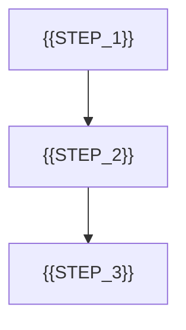

# 业务流程模板

> 适用场景：项目有明确业务链路、角色协作、状态推进或关键路径时使用。
> 可不生成/可合并：若流程很短，可合并到项目说明清单或状态文档；若核心是页面导航而非业务流，可优先生成页面地图。

## 1. 文档目标

- 说明关键业务流程、触发条件与结果输出
- 帮助后续页面设计、数据设计与状态设计保持一致

## 2. 核心流程

## 3. 流程说明

| 步骤 | 触发者 | 输入/前置条件 | 输出/结果 |
|------|------|------|------|
| `{{STEP_NAME}}` | `{{ACTOR}}` | `{{INPUT}}` | `{{OUTPUT}}` |

## 4. 异常与待确认

- `{{EXCEPTION_OR_OPEN_ISSUE}}`
